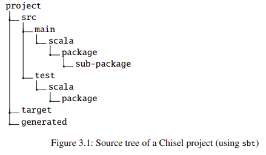
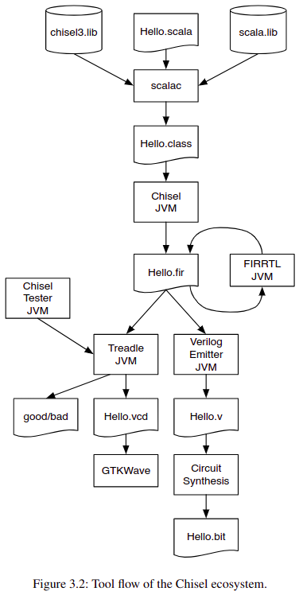

# 构建与测试
Chise是用Scala编写的，Scala流行的构建工具是sbt， 除了构建和测试，sbt还会从Maven仓库下载正确版本的Scala和Chisel库。库通过build.sbt引用。可以通过在build.sbt中配置latest.release来始终使用Chisel的最新版本，尽量使用稳定版本的库以避免每次都需要联网下载。

## 源码组建形式
sbt继承Maven构建工具。Maven还组织了Java库仓库。

上图为Chisel项目的源码树的组织结构。项目的主目录其中包含build.sbt。它还可能包括用于构建过程的Makefile，README和一个LICENSE文件。src目录下包含所有的源码。分为main目录包含源码和测试。下一个目录为scala因为Chisel基于Scala。如果你想包含Java代码，这对硬件生成器是游泳的，你可以添加一个java目录。Chise继承自Scala，而Scala有继承自Java。建议增加一个generated的目录用来存放生成的verilog文件。

要在Chisel中使用命名空间功能，需要声明一个class/module 下面是个例子
```
package mypack

import chisel3._

class Abc extends Module {
    val io = IO(new Bundle{})
}
```
请注意，在这个例子中，我们导入chisel3包以使用Chisel class/Module

当需要导入mypack包时。下划线`_`充当通配符，意味着mypack中所有的class都会被import
```
import mypack._

class AbcUser extends Module {
    val io = IO(new Bundle {})

    val abc = new Abc()
}
```
也可以不导入所有类型，而是使用完全限定的名mypack.Abc来引用mypack包中的Abc模块
```
class AbcUser2 extends Module {
    val io = IO(new Bundle {})
    
    val abc = new mypack.Abc()
}
```
也可只导入具体的class
```
import mypack.Abc

class AbcUser3 extends Module {
    val io = IO(new Bundle {})

    val abc = new Abc()
}
```

## 运行sbt
Chisel project的编译
```
$ sbt run
```
这个命令将编译代码树中的所有Chisel代码，并搜索包含具有main方法或extend App的对象或class。如果有多个这样的对象，所有对象都会列出，可以进行选择。也可以直接指定要编译的对象。
```
$ sbt "runMain mypacket.MyObject"
```
默认情况下，sbt仅搜索代码树的main，而不搜索测试部分。要执行基于ChiselTest的测试，可以执行
```
$ sbt test
```
如果你有一个不遵循ChiselTest约定的主函数的测试，但它被放置在源码树的测试部分，你可以执行
```
$ sbt "test:runMain mypacket.MyMainTest"
```

## 生成Verilog
为了生成FPGA或ASIC的Chisel代码，需要将Chisel翻译合成工具生成硬件描述语言。

要生成Verilog，我们需要一个应用程序。一个extends App的Scala对象是一个隐式生成主函数的应用程序，其中应用程序开始执行。
```
object Hello extends App {
    emitVerilog(now Hello())
}
```
使用emitVerilog()的默认版本将生成的文件放入项目的根文件目录。要将生成的文件放入子目录中，需要为emitVerilog()指定选项。建议保存到一个名为generated的目录。例如：
```
object HelloOption extends App {
    emitVerilog(new Hello(), Array("--target-dir", "generated"))
}
```
还可以将Verilog代码作为Scala字符串输出，无需保存到文件。
```
object HelloString extends App {
    val s = getVerilogString(new Hello())
    println(s)
}
```
这种输出形式在[Scasite](https://scastie.scala-lang.org/)（一个基于网页的Scala运行时编译器）中展示Chisel示例。[Hello World on Scasite](https://scastie.scala-lang.org/schoeberl/SN7rDb9iS027ORiWqXMGsQ/6)

## 工具流

Scala编译器将Hello.scala与Chisel和Scala库一起编译，并生成可以由Java虚拟机执行的java class文件Hello.class。使用Chisel驱动程序执行这个class会生成RTL的灵活中间表示（FIR-RTL），这是数字电路的中间表示。在我们的例子中，文件为Hello.fir。FIRRTL编译器对电路进行转换。

Treadle JVM是一个FIRRTL解释器，可以模拟电路。与Chisel tester一起使用时，可以调试和测试Chisel电路。通过assert我们可以提供测试结果。Treadle还可以生成波形文件。（Hello.vcd）可以使用波形查看器GTKWave或Modelsim查看。

Verilog Emitter是一个FIRRTL转换Verilog的工具（Hello.v）可通过电路综合工具（例如：Quartus，Vivadi或ASIC工具）综合电路，生成bit文件用于烧录到FPGA设备上验证。

## Chisel版本
Chisel版本形式为MAJOR.MINOR.PATCH
从Chisel5开始，CHisel后端已经从基于Scala的FIRRTL编译器更改为使用firtool生成Verilog。firtoool是一个更大项目LLVM CIRCT项目的一部分。Chisel3的最新版本是3.6,包含了两个后端基于Scala的编译器和firtool。3.6的build.sbt如下：
```
scalaVersion := "2.13.14"

scalacOptions ++=Seq(
    "-deprecation",
    "-feature",
    "-unchecked",
    "-language:reflectiveCalls",
)

val chiselVersion = "3.6.1"
addCompilerPlugin ("edu. berkeley .cs" % "chisel3 -plugin" %
chiselVersion cross CrossVersion .full)
libraryDependencies += "edu. berkeley .cs" %% " chisel3 " %
chiselVersion
libraryDependencies += "edu. berkeley .cs" %% " chiseltest " %
"0.6.1
```
在chisel5中，firtool二进制文件需要手动安装。Chisel6将firtool包含在Chisel库中，因此推荐使用最新版本。
